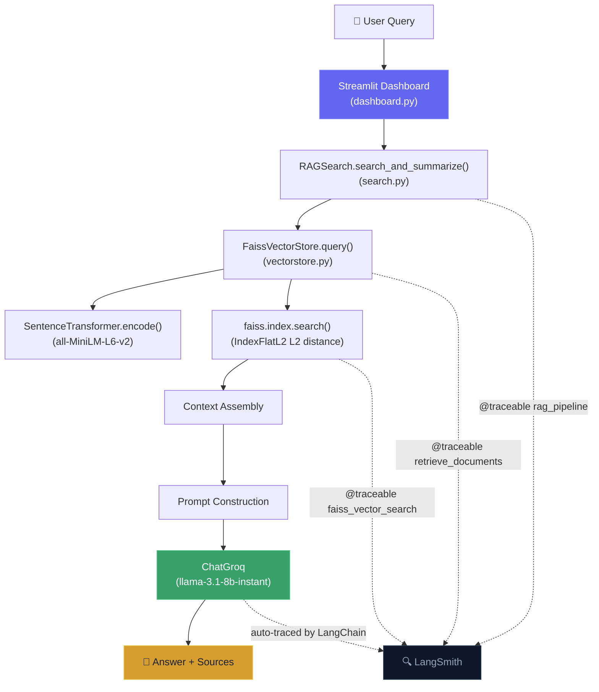

# 📄 RAG PDF Question Answering

A modular **Retrieval-Augmented Generation** pipeline for querying PDF and text documents using semantic search. Documents are chunked, embedded with SentenceTransformers, indexed in FAISS, and answered via Groq's LLM — with a **Streamlit dashboard** and full **LangSmith observability**.

---

## Features

- **Streamlit dashboard** — Interactive chat UI with source display, metrics, and document upload
- **Multi-format document loading** — Ingests PDFs and text files via LangChain loaders
- **Recursive text splitting** — Configurable chunk size and overlap for optimal retrieval
- **Sentence embeddings** — 384-dimensional vectors using `all-MiniLM-L6-v2`
- **FAISS vector store** — Persistent L2 similarity search with serialized index and metadata
- **LLM-powered answers** — Summarizes retrieved context using Groq (`llama-3.1-8b-instant`)
- **LangSmith tracing** — Full observability: latency, token usage, retrieval traces, nested spans
- **Automatic index management** — Builds on first run, reuses persisted index on subsequent runs
- **Production logging** — Python `logging` module throughout; no debug `print` statements

---

## Architecture



---

## Project Structure

```text
rag-pdf-qa/
├── dashboard.py              # Streamlit dashboard (chat UI)
├── app.py                    # CLI entry point (script usage)
├── main.py                   # Placeholder script
├── src/
│   ├── __init__.py
│   ├── data_loader.py        # Document loading (PDF, TXT) — @traceable
│   ├── embedding.py          # Text chunking and embedding — @traceable
│   ├── vectorstore.py        # FAISS index management — @traceable
│   └── search.py             # RAG orchestration (root @traceable span)
├── data/
│   ├── pdf/                  # Place PDF files here
│   └── text_files/           # Place text files here
├── faiss_store/              # Persisted FAISS index (git-ignored)
├── notebook/
│   ├── document.ipynb
│   └── pdf_loader.ipynb
├── pyproject.toml
├── requirements.txt
└── .env                      # API keys (git-ignored)
```

### Module Responsibilities

| Module | Responsibility |
|---|---|
| `dashboard.py` | Streamlit chat UI — query input, answer display, source chunks, metrics, file upload, index management |
| `data_loader.py` | Recursively discovers and loads `.pdf` and `.txt` files via LangChain loaders |
| `embedding.py` | Splits documents into chunks with `RecursiveCharacterTextSplitter`, encodes with `SentenceTransformer` |
| `vectorstore.py` | Manages a FAISS `IndexFlatL2` index — build, add, persist, load, similarity search |
| `search.py` | Orchestrates the RAG pipeline: retrieves chunks, builds context, generates answer via Groq |

---

## Installation

### Using uv (recommended)

```bash
git clone https://github.com/abhip161/rag-pdf-qa.git
cd rag-pdf-qa
uv sync
```

### Using pip

```bash
git clone https://github.com/abhip161/rag-pdf-qa.git
cd rag-pdf-qa

python -m venv .venv

# Windows
.venv\Scripts\activate
# macOS / Linux
source .venv/bin/activate

pip install -r requirements.txt
```

---

## Configuration

Create a `.env` file in the project root (already git-ignored):

```env
# Groq
GROQ_API_KEY=your_groq_api_key_here

# LangSmith (optional — enables tracing)
LANGSMITH_API_KEY=your_langsmith_api_key_here
LANGSMITH_TRACING=true
LANGSMITH_PROJECT=rag-pdf-qa
```

| Variable | Description | Required |
|---|---|---|
| `GROQ_API_KEY` | API key from [Groq Console](https://console.groq.com/) | ✅ Yes |
| `LANGSMITH_API_KEY` | API key from [LangSmith](https://smith.langchain.com/) | Optional |
| `LANGSMITH_TRACING` | Set to `true` to enable tracing | Optional |
| `LANGSMITH_PROJECT` | Project name shown in LangSmith UI | Optional |

---

## Usage

### Streamlit Dashboard (recommended)

```bash
streamlit run dashboard.py
```

Opens at `http://localhost:8501` with:

- **Sidebar** — API status badges, LLM/embedding model selector, top-k slider, index rebuild, document upload
- **Chat area** — Ask questions, see answers grounded in your documents
- **Source chunks** — Expandable section showing which chunks were retrieved
- **Metrics** — Latency, number of chunks retrieved, model used per response

### CLI

```bash
python app.py
```

### Programmatic usage

```python
from src.search import RAGSearch

rag = RAGSearch()
answer = rag.search_and_summarize("What is positional encoding?", top_k=3)
print(answer)
```

#### Constructor parameters

```python
RAGSearch(
    persist_dir="faiss_store",           # Directory for FAISS index persistence
    embedding_model="all-MiniLM-L6-v2",  # SentenceTransformer model name
    llm_model="llama-3.1-8b-instant"     # Groq LLM model
)
```

---

## How It Works

1. **Document Loading** — `data_loader.py` recursively scans the data directory for `.pdf` and `.txt` files, loading them into LangChain `Document` objects.

2. **Chunking** — `embedding.py` splits documents into 1000-character chunks with 200-character overlap using `RecursiveCharacterTextSplitter`.

3. **Embedding** — Each chunk is encoded into a 384-dimensional vector using `all-MiniLM-L6-v2`.

4. **Indexing** — `vectorstore.py` builds a FAISS `IndexFlatL2` index. The index and metadata are serialized to disk (`faiss.index` + `metadata.pkl`).

5. **Retrieval** — The user query is embedded with the same model and searched against the FAISS index (L2 distance). The top-k most similar chunks are returned.

6. **Generation** — Retrieved chunks are concatenated into a context string and sent to Groq's LLM with a summarization prompt. The answer is streamed back to the UI.

---

## LangSmith Observability

When `LANGSMITH_TRACING=true`, every query produces a full trace in LangSmith:

```
[chain] rag_pipeline                    ← search_and_summarize() — root span
  ├── [retriever] retrieve_documents    ← vectorstore.query()
  │     └── [tool] faiss_vector_search  ← vectorstore.search()
  └── [llm] ChatGroq                    ← auto-traced by LangChain
```

**Metadata visible per trace:**

| Field | Where |
|---|---|
| `query`, `top_k` | Root span inputs |
| `embedding_model`, `llm_model` | Root span metadata |
| `num_retrieved_docs`, `vector_store_type` | Root span metadata |
| Token usage (prompt + completion) | ChatGroq span |
| Latency per span | All spans |
| Distances, indices | `faiss_vector_search` outputs |

**Verify tracing:**
1. Run `streamlit run dashboard.py` or `python app.py`
2. Open [smith.langchain.com](https://smith.langchain.com) → project **`rag-pdf-qa`**
3. A new trace named `rag_pipeline` appears within seconds

---

## Technologies

| Category | Technology | Purpose |
|---|---|---|
| Language | Python 3.14+ | Core runtime |
| UI | Streamlit ≥ 1.40 | Dashboard and chat interface |
| Framework | LangChain | Document loading, text splitting |
| Embeddings | SentenceTransformers (`all-MiniLM-L6-v2`) | 384-dim sentence embeddings |
| Vector Store | FAISS (`faiss-cpu`) | L2 similarity search |
| LLM | Groq (`llama-3.1-8b-instant`) | Answer generation |
| LLM Client | `langchain-groq` | Groq API integration |
| Observability | LangSmith | Tracing, latency, token usage |
| PDF Parsing | PyPDF, PyMuPDF | PDF text extraction |
| Config | python-dotenv | Environment variable management |
| Package Manager | uv | Dependency management |

---

## Future Improvements

- **Hybrid search** — Combine dense (FAISS) and sparse (BM25) retrieval for better recall
- **Metadata filtering** — Filter results by source file or page number
- **Streaming responses** — Stream LLM output token-by-token in the dashboard
- **Async processing** — Parallelize document loading and embedding generation
- **Source citations** — Include page number and filename alongside each retrieved chunk
- **LangSmith evaluation** — Automated RAG quality scoring with `langsmith.evaluate()`
- **LCEL chain** — Migrate pipeline to `RunnableSequence` for native streaming traces
- **Re-ranking** — Cross-encoder re-ranking step after initial FAISS retrieval
- **Multi-collection** — Support multiple isolated document collections
- **Support for more formats** — DOCX, Markdown, HTML, CSV loaders

---

## Contributing

Contributions are welcome. To get started:

1. Fork the repository
2. Create a feature branch (`git checkout -b feature/your-feature`)
3. Commit your changes (`git commit -m "Add your feature"`)
4. Push to the branch (`git push origin feature/your-feature`)
5. Open a Pull Request

---

## License

This project is licensed under the [MIT License](LICENSE).
